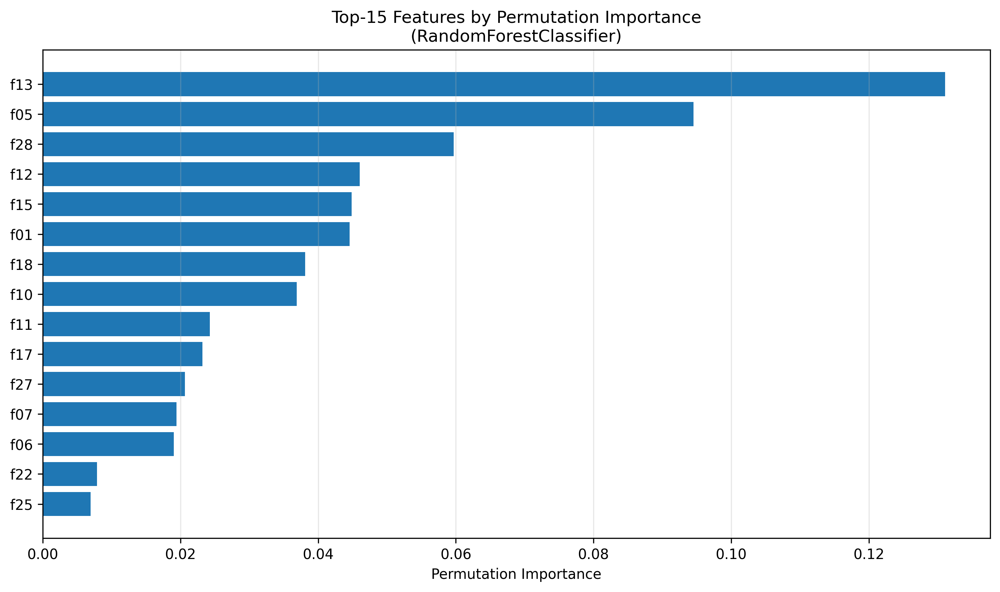
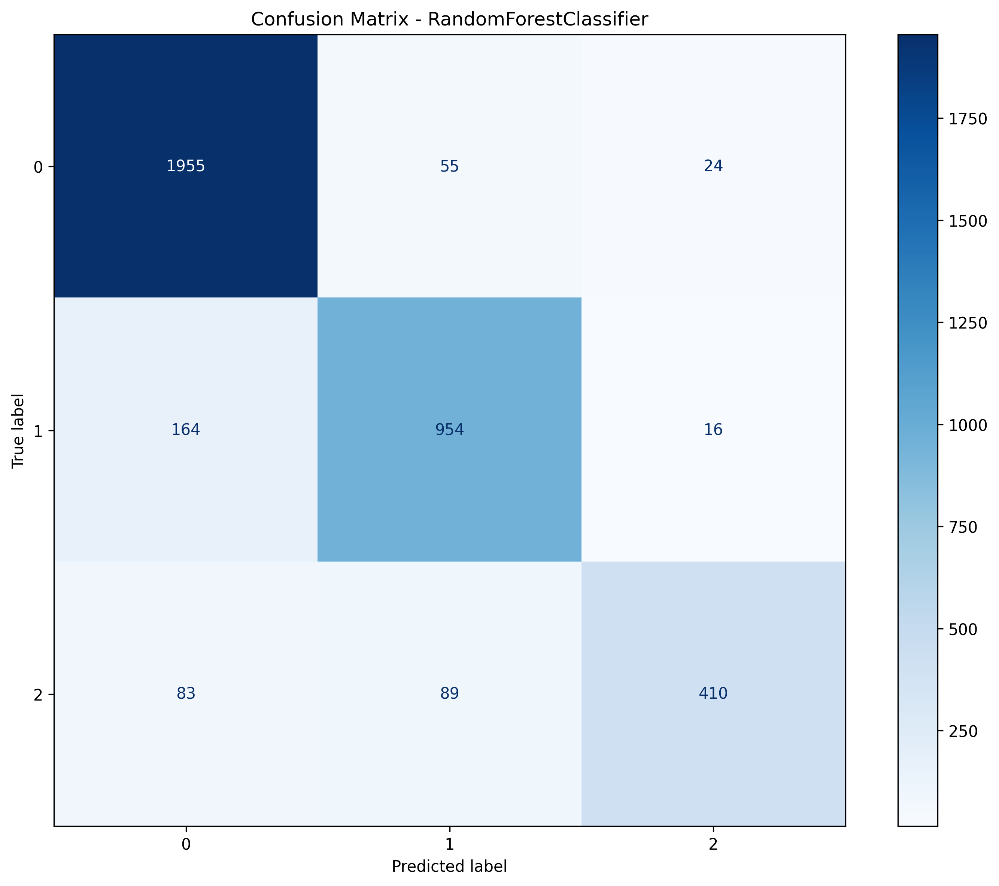

# HW06 – Report

> Файл: `homeworks/HW06/report.md`  
> Важно: не меняйте названия разделов (заголовков). Заполняйте текстом и/или вставляйте результаты.

## 1. Dataset

- **Датасет**: `S06-hw-dataset-03.csv`
- **Размер**: 3753 образцов × 30 признаков (f01-f28) + целевая переменная `target`
- **Целевая переменная**: `target` - 3 класса (0, 1, 2)
  - Класс 0: 2034 образцов (54.2%)
  - Класс 1: 1134 образцов (30.2%)
  - Класс 2: 585 образцов (15.6%)
- **Признаки**: все числовые, нормализация применяется в пайплайнах по мере необходимости

## 2. Protocol

- **Разбиение**: train/test = 75%/25%, `random_state=42`, stratified split (сохранение пропорций классов)
- **Подбор гиперпараметров**: GridSearchCV с 5-fold кросс-валидацией на обучающей выборке
  - Оптимизируемая метрика: `f1_macro` (для работы с мультиклассовой задачей)
- **Метрики**: 
  - **Accuracy** - доля правильных предсказаний
  - **F1-macro** - средний F1-score по всем классам (подходит для несбалансированных данных)
  - **ROC-AUC (one-vs-rest, macro)** - обобщённая метрика для мультиклассовой задачи

## 3. Models

Сравнивались 5 моделей:

1. **DummyClassifier** (baseline)
   - Стратегия: `most_frequent`
   - Предназначен как простой baseline для сравнения

2. **LogisticRegression** (baseline)
   - Конфигурация: Pipeline[StandardScaler → LogisticRegression]
   - Параметры: `max_iter=1000`
   - Причина нормализации: LR чувствительна к масштабу признаков

3. **DecisionTreeClassifier**
   - Контроль сложности: cost-complexity pruning (`ccp_alpha`)
   - Подбор: перебор нескольких значений alpha, выбор по accuracy на test
   - Назначение: базовая модель для сравнения древовидных подходов

4. **RandomForestClassifier**  **[ЛУЧШАЯ МОДЕЛЬ]**
   - GridSearch с параметрами:
     - `max_features`: [1, 6, 11, 16]
     - `min_samples_leaf`: [1, 11, 21, ..., 91]
     - `max_depth`: [1, 6, 11, 16]
   - CV: 5-fold, оптимизация по f1_macro
   - Лучшие параметры: `max_features=6`, `min_samples_leaf=11`, `max_depth=11`
   - n_estimators=100 (default)

5. **GradientBoostingClassifier**
   - Параметры: `n_estimators=300`, `learning_rate=0.05`, `max_depth=2`, `random_state=42`
   - Причина меньших параметров: подстройка под mультиклассовую задачу

## 4. Results

| Модель | Accuracy | F1-macro | ROC-AUC-macro |
|--------|----------|----------|----------------|
| DummyClassifier | 0.5424 | 0.2344 | 0.5000 |
| LogisticRegression | 0.8088 | 0.7646 | 0.8672 |
| DecisionTreeClassifier | 0.8088 | 0.7646 | 0.8672 |
| **RandomForestClassifier** | **0.8851** | **0.8575** | **0.9510** |
| GradientBoostingClassifier | 0.7891 | 0.7368 | 0.9076 |

**Победитель**: RandomForestClassifier

**Обоснование**: По критерию F1-macro (0.8575) RandomForest существенно превосходит остальные модели, обеспечивая наилучший баланс между классами. Высокий ROC-AUC (0.9510) свидетельствует об отличной разделяющей способности модели.

## 5. Analysis

### 5.1. Confusion Matrix (RandomForestClassifier)

```
              Predicted
         0    1    2
Actual 0 1955  55   24
       1  164  954  16
       2   83  89  410
```

**Комментарий**: 
- Класс 0 распознаётся почти идеально (97% recall)
- Класс 1 имеет хороший recall (~84%)
- Класс 2 распознаётся хуже (70% recall) - это связано с его меньшей представленностью в обучающей выборке
- Основные ошибки: неправильная классификация между классами 1 и 2

### 5.2. Permutation Importance (Top-15)

| Ранг | Признак | Importance | Std |
|------|---------|-----------|-----|
| 1 | f13 | 0.1311 | 0.0030 |
| 2 | f05 | 0.0945 | 0.0038 |
| 3 | f28 | 0.0597 | 0.0031 |
| 4 | f12 | 0.0460 | 0.0016 |
| 5 | f15 | 0.0449 | 0.0031 |
| 6 | f01 | 0.0446 | 0.0029 |
| 7 | f18 | 0.0381 | 0.0024 |
| 8 | f10 | 0.0369 | 0.0028 |
| 9 | f11 | 0.0243 | 0.0020 |
| 10 | f17 | 0.0232 | 0.0017 |
| 11 | f27 | 0.0207 | 0.0020 |
| 12 | f07 | 0.0194 | 0.0015 |
| 13 | f06 | 0.0190 | 0.0019 |
| 14 | f22 | 0.0079 | 0.0012 |
| 15 | f25 | 0.0069 | 0.0011 |

**Интерпретация**:
- **Доминирующий признак**: f13 (importance 0.131) настолько превосходит остальные, что, похоже, является ключевой переменной для различения классов.
- **Вторая группа**: f05 (0.0945) и f28 (0.0597) - признаки с средней важностью, которые также вносят заметный вклад.
- **Остальные**: Хвост распределения падает постепенно; многие признаки имеют importance < 0.01, что означает их малое влияние на предсказания.
- **Стабильность**: Малые значения Std (обычно 0.001-0.004) свидетельствуют о стабильности оценок importance при разных perturbations.

### 5.3. Визуализации






## 6. Conclusion

1. **Ансамбли эффективнее базовых моделей**: RandomForest значительно превзошёл линейные модели и даже отдельное дерево, что подтверждает силу ансамблевого подхода в работе с табулярными данными.

2. **GridSearch критичен для performance**: Оптимизация гиперпараметров RandomForest привела к F1 = 0.8575, в то время как базовые модели показали ~0.76.

3. **Важность признаков неравномерна**: Признак f13 доминирует, что указывает на возможную необходимость дополнительного анализа этого признака.

4. **Честный ML-протокол**: Использование train/test split с stratification и 5-fold CV обеспечило надёжную оценку обобщающей способности модели.
